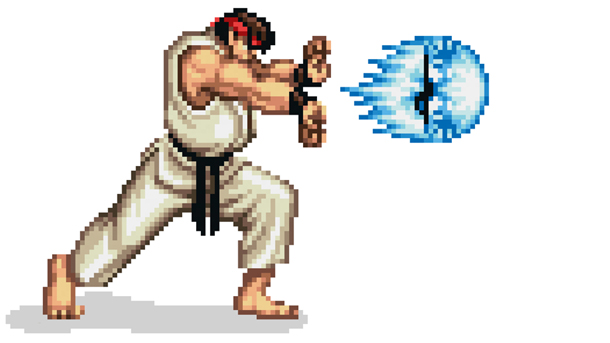

# Hadeuku

**Hadeuku** is a simple two-player fighting game built with Greenfoot. Inspired by classic arcade fighters, players control their characters to move, jump, and unleash special attacks like the iconic "Hadouken" to defeat their opponent.

## Gameplay

- **Players:** 2 (Player 1 and Player 2)
- **Objective:** Reduce your opponent's health to zero by landing attacks and special moves.
- **Controls:**
  - Player 1: (customize as per your code, e.g., WASD to move, F to attack)
  - Player 2: (customize as per your code, e.g., Arrow keys to move, L to attack)
- **Special Moves:** Each player can perform a "Hadouken" attack, which travels across the screen and deals extra damage.
- **Counters:** The game tracks the number of successful hits or streaks for each player.

## How It Works

- The game world (`MyWorld`) sets up the arena, players, and counters.
- Each player (`Player1`, `Player2`) can move, jump, and attack.
- Special attacks (`Hadouken`, `Hadouken2`) can be launched and will interact with the opponent.
- The ground and streaks are managed by their respective classes.
- Counters (`P1CounterImage`, `P2CounterImage`) display each player's score or health.

## File Overview

- `MyWorld.java` – Sets up the game world and manages the main loop.
- `Player1.java`, `Player2.java` – Player character logic and controls.
- `Hadouken.java`, `Hadouken2.java` – Special attack projectiles.
- `Ground.java` – The arena floor.
- `Streak.java`, `Streak2.java` – Tracks combos or hit streaks.
- `P1CounterImage.java`, `P2CounterImage.java` – Displays player scores or health.

## Customization

- You can modify player controls, graphics, and rules by editing the respective Java files.
- Add new moves or effects by creating new classes or extending existing ones.
- Add your own image files or request them from me.